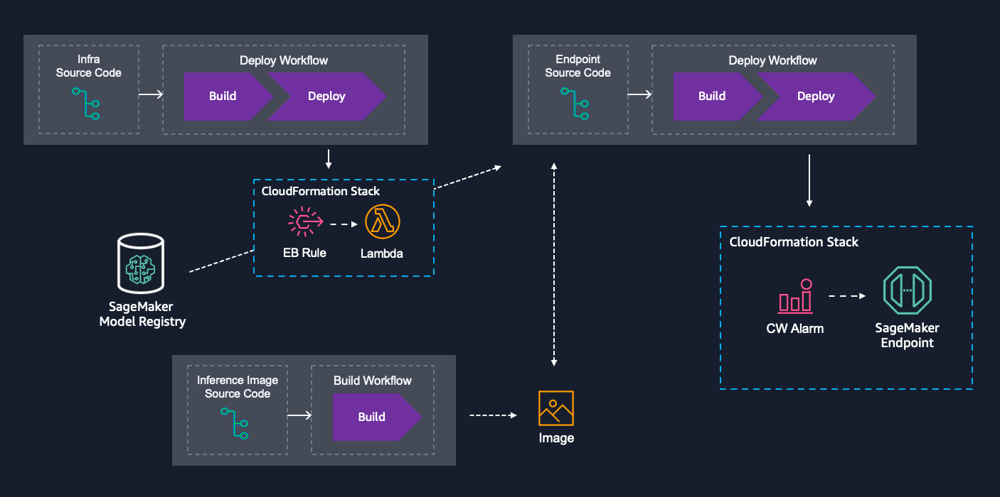

## Deploy SM endpoints from the SM model registry automatically

Sample for setting up an end-to-end deployment flow from SageMaker model registry, to a SageMaker endpoint with a custom Docker container.

### Overview

#### `/sagemaker_endpoint`

The script fetching relevant parameters and the cloudformation that's deployed from Github Actions, creating the SageMaker Endpoint and the related resources like execution role, SM model, endpoint configuration etc.

##### `/.github/workflows/deploy_endpoint.yml`

Github Actions workflow that deploys the resources in `/sagemaker_endpoint`

#### `/infra`

The necessary infrastructure to "connect" the specified model registry with Github Actions.

##### `/.github/workflows/deploy_infra.yml`

Github Actions workflow that deploys the resources in `/infra`

#### `/image_inferece`

The inference image, which is deployed to a SageMaker endpoint

##### `/.github/workflows/build_image.yml`

Github Actions workflow that build and stores the inference image in ECR
